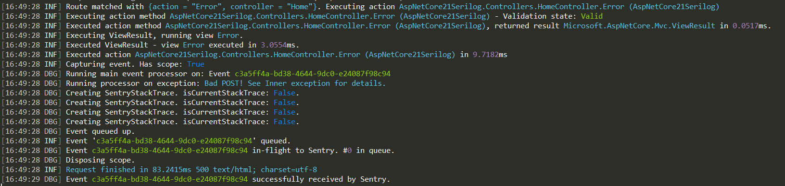

To run this sample, edit [appsettings.json](appsettings.json) and set your DSN to see the events in Sentry.

Check [Program.cs](Program.cs) to see some customization done via the `WebHostBuilder`.

### In this sample we demonstrate the following:

* Initialize the SDK via the ASP.NET Integration (Program.cs UseSentry())
* Configure the SDK via the framework configuration system (appsettings.json, env var, etc)
* Using a custom `ExceptionProcessor`. (See `SpecialExceptionProcessor.cs` which takes dependencies vai DI)
* Adding custom data to be reported with the exception (See `HomeController.cs` `PostIndex` action, the catch block adding to `Data` property of the exception)
* Capturing an exception manually via an injected `IHub`. (See `HomeController.cs` `Contact` action.)
* Captures an unhandled exception coming from a view (See `About.cshtml` which throws an exception that goes through the `SpecialExceptionProcessor.cs`)
* Including the request payload with the event (done via appsettings.json `IncludeRequestPayload`)
* Enable SDK Debugging via `appsettings.json`. The SDK internal logs are output via Serilog (see screenshot below). In this sample is Console.

Example output of Sentry SDK through Serilog logging:

)

Example event:

