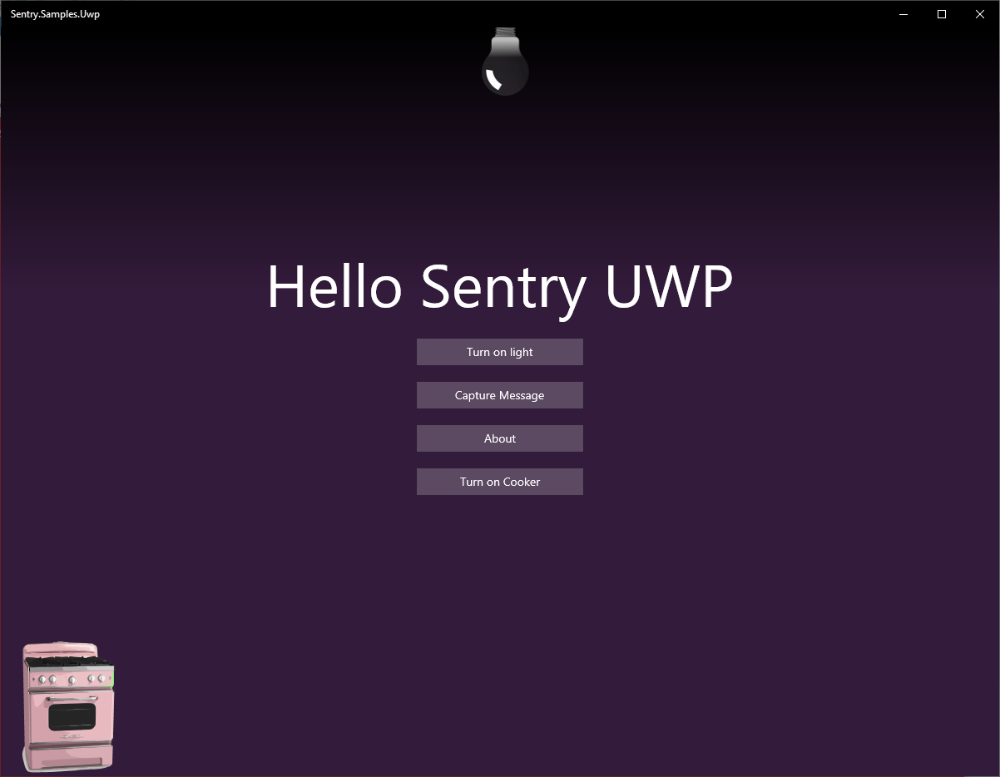

# Universal Windows Platform Sentry demo

UWP Demo project for Sentry using the .NET SDK

Make sure to add [your own DSN](https://docs.sentry.io/product/sentry-basics/dsn-explainer/) to [Program.cs](App.xaml.cs) to see the events in your own Sentry project.

## See this sample in action on YouTube

### Run the sample

#### Requirements

Install the required SDK:
* Windows 10 build 16299 or higher.
* Visual Studio 2019 or newer.
* [Universal Windows Platform development SDK](https://docs.microsoft.com/en-us/visualstudio/cross-platform/develop-apps-for-the-universal-windows-platform-uwp?view=vs-2019)

#### Deploying

You must have [Developer mode](https://docs.microsoft.com/en-us/windows/apps/get-started/enable-your-device-for-development?OCID=WinClient_Ver1703_Settings_DevMode) activated on your Windows device.
All you need to do is to open the project with Visual Studio and run the project.

## Screenshots 

