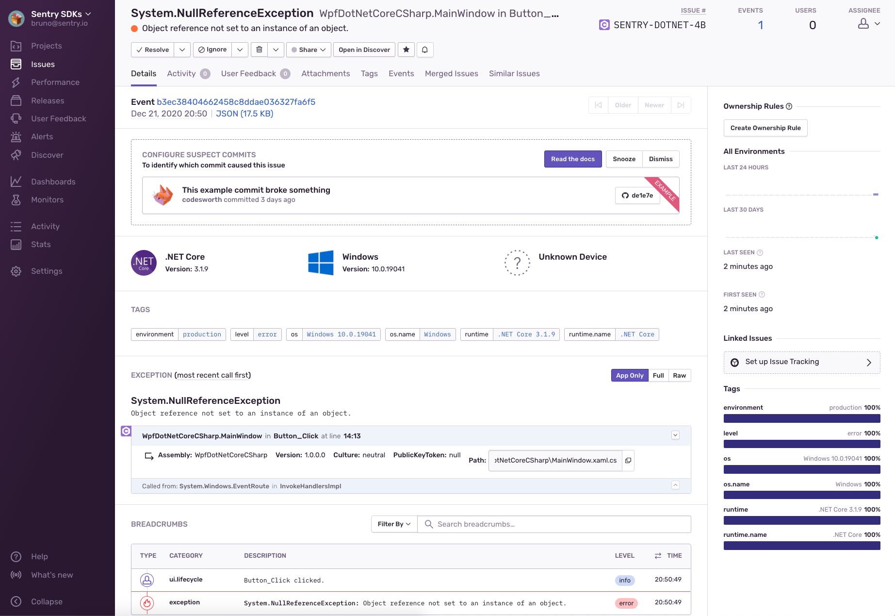

# Sentry for Windows Presentation Foundation

This example shows how to initalize Sentry and capture a crash of the WPF app.

Make sure to add [your own DSN](https://docs.sentry.io/product/sentry-basics/dsn-explainer/) to [App.xaml.cs](App.xaml.cs) to see the events in your own Sentry project.

## Next steps

Check out the [Sentry docs for more options of the .NET and WPF SDKs.(https://docs.sentry.io/platforms/dotnet/guides/winforms/) 