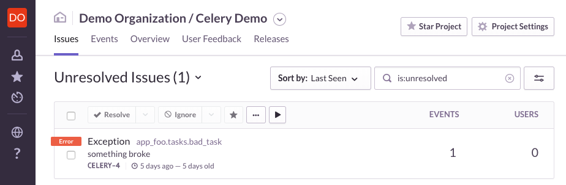

# Celery Example for [getsentry](https://github.com/getsentry)


### Table of Contents

- [Introduction](#introduction)
- [About Celery](#about-celery)
- [About This Demo](#about-this-demo)
- [Running The Demo](#running-the-demo)

## Introduction

[Sentry](https://sentry.io/welcome/) provides open source error tracking that shows you every crash in your stack as it happens, with the details needed to prioritize, identify, reproduce, and fix each issue. It also gives you information your support team can use to reach out to and help those affected and tools that let users send you feedback for peace of mind.

Sentry was conceived in 2010 with a simple aim of illuminating production application issues. It started as a tiny bit of Open Source code, and has since expanded to an incredible team and hundreds of contributors, and now support all popular languages and platforms.

Read about how Sentry came to be on [StackShare](https://stackshare.io/posts/founder-stories-how-sentry-built-their-open-source-service).

## About Celery

[Celery](http://www.celeryproject.org/) is a popular asynchronous task management framework. It is often integrated with a web application to allow computational work to be done outside the usual request-response cycle.

A refresher on Celery vocabulary:

* A **Task** is a Python function that will be triggered asynchronously
* A **Worker** is the Python process where Tasks execute, regardless of where they are triggered
* The **Broker** is a network service that stores the Task queue and metadata; in real applications this is usually RabbitMQ or Redis
* The **Application** is a Python object that contains the Celery configuration, registers Tasks, and communicates with the Broker

(Confusingly, the Celery Application must be instantiated in each Python process that triggers or runs Tasks; in the case of this demo both the web frontend **and** the Celery Worker.)

## About This Demo

This demo provides a basic example of [integrating Sentry with the Celery Application](https://docs.sentry.io/clients/python/integrations/celery/). To play with this demo, you'll need to create a Sentry account, and [update the Worker configuration with your DSN](#configuring-sentry).

The code for this demo is divided into two components:

* A minimal Flask-based web app that responds to HTTP requests
* A Celery Worker loaded with two Tasks: one that always works and one that always errors

Each of these components runs in a separate process. They are configured to communicate using RabbitMQ running on `localhost` on port 5672.

The web app does **not** load the Sentry client library (Raven); the Celery Worker **does** load Raven so it can report errors to Sentry. This is intentional and done as a reminder that each process in your larger app can be configured to report independently to separate Sentry DSNs or not at all.

*Note:* This demo uses Celery 3.1 which is not the latest version, based on the assumption that existing applications might not have upgraded yet. The procedure for integrating Raven/Sentry with Celery 4.0+ should be very similar.

## Running The Demo

For ease of isolating the demonstration code, it is best to use a [Python virtualenv](https://virtualenv.pypa.io/en/stable/) to contain the installed packages. Installing Python, pip, and virtualenv are outside the scope of this demo.

```
virtualenv celery_example
. celery_example/bin/activate
pip install -r ./requirements.txt
```

The following sections describe running three pieces of software: The Celery Broker (RabbitMQ), the Celery Worker, and the web frontend. For ease of monitoring each of them, it is recommended to start each one in a separate terminal window or tab.

### Configuring Sentry

Raven, the Sentry client library, uses a [DSN generated from Sentry](https://docs.sentry.io/quickstart/#configure-the-dsn) to collect errors and send them to the right place.

Replace the dummy DSN in [async.py](demo/settings/async.py) with a DSN for one of your projects. You can find these under Settings > Client Keys in your account.

### Starting The Broker

The easiest way to get RabbitMQ installed and running for this demo is using Docker. Installing Docker and related services is outside the scope of this demo.

This will obtain the latest RabbitMQ container and run it in the foreground with appropriate settings for the demo:

```
docker pull rabbitmq:alpine
docker run -p 5672:5672 --hostname rabbit --name rabbit rabbitmq:alpine
```

### Starting the Celery Worker

With the `celery_example` virtualenv activated, run `./worker.sh` from within this directory.

This will launch the Celery Worker process in the foreground. It should successfully register Tasks and, if RabbitMQ is running, communicate with the Broker.

A successful start will look something like this:

```
 -------------- celery@computername.local v3.1.25 (Cipater)
---- **** -----
--- * ***  * -- Darwin-17.2.0-x86_64-i386-64bit
-- * - **** ---
- ** ---------- [config]
- ** ---------- .> app:         settings.async:0x103df86d0
- ** ---------- .> transport:   amqp://guest:**@localhost:5672//
- ** ---------- .> results:     disabled://
- *** --- * --- .> concurrency: 4 (prefork)
-- ******* ----
--- ***** ----- [queues]
 -------------- .> celery           exchange=celery(direct) key=celery


[tasks]
  . app_bar.tasks.good_task
  . app_foo.tasks.bad_task

[2017-11-21 11:16:01,315: INFO/MainProcess] Connected to amqp://guest:**@127.0.0.1:5672//
[2017-11-21 11:16:01,346: INFO/MainProcess] mingle: searching for neighbors
[2017-11-21 11:16:02,371: INFO/MainProcess] mingle: all alone
[2017-11-21 11:16:02,388: WARNING/MainProcess] celery@computername.local ready.
```

#### Problems Starting The Worker

```
[2017-11-21 11:15:55,492: WARNING/MainProcess] Sentry responded with an error: HTTP Error 403: OK (url: https://sentry.io/api/<project>/store/)
```

An error like the above probably means the Sentry DSN is misconfigured. Make sure to copy a good DSN from Sentry and put it in the demo's configuration as described in [Configuring Sentry](#configuring-sentry)


```
[2017-11-21 11:15:55,492: ERROR/MainProcess] [u'consumer: Cannot connect to amqp://guest:**@127.0.0.1:5672//: Socket closed.\nTrying again in 2.00 seconds...\n']
```

An error like the above means the Celery Broker (RabbitMQ) is not running as expected. Try re-running the Docker commands under [Starting The Broker](#starting-the-broker) in another terminal window and leave it running!

### Starting The Web Frontend

With the `celery_example` virtualenv activated, run `./web.sh` from within this directory.

### Trying It Out

Surfing to http://127.0.0.1:5000/ while the web frontend is running will attempt to trigger two Celery tasks: the good task and the bad task.

If *triggering* the tasks causes any exceptions, the reason will be displayed in the browser (because `DEBUG` is enabled in Flask). If they succeed, you will see "Hello World." in your browser.

If all three processes are running, there should be no errors triggering the tasks. Even though the "bad" Task always breaks, this error *does not affect the web frontend*.

Raven should capture the exception from running the "bad" Task and transmit it to Sentry. Check your Sentry dashboard for the event, which should look something like this:



## Cleaning Up

Pressing Ctrl-C once in each terminal window should stop the Broker, the web frontend, and the Celery Worker.

`docker rm rabbit` will delete the Docker container that was launched for the Broker. The disk images that were downloaded can be listed with `docker images` and manually removed with `docker rmi IMAGE_ID`.

`rm -r celery_example` will delete the virtualenv directory containing all the installed Python packages.

## Contributing

Looking to get started contributing to Sentry? Our [internal documentation](https://docs.sentry.io/internal/) has you covered.

## Anything Else?

[Tweet](https://twitter.com/getsentry), [email](hello@sentry.io), or visit our [forum](https://forum.sentry.io)!

## A Footnote On Names

Naming is intentionally different at each stage (e.g. `worker` for the command, `backend` in the code, `async` for the settings file) to be contrary to the many examples that ambiguously use "celery" and "app", which can sometimes complicate import ordering.
