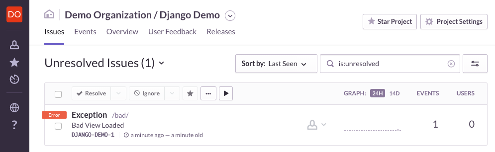

# Django Example for [getsentry](https://github.com/getsentry)

### Table of Contents

- [Introduction](#introduction)
- [About Django](#about-django)
- [About This Demo](#about-this-demo)
- [Running The Demo](#running-the-demo)

## Introduction

[Sentry](https://sentry.io/welcome/) is an open source tool that provides error tracking to show you every crash in your application as it happens, with the details needed to prioritize, identify, reproduce, and fix each issue.

## About Django

[Django](https://www.djangoproject.com/) is a popular web framework used for many projects large and small, including [Sentry itself](https://github.com/getsentry/sentry/).

It includes an object-relational mapper, a templating engine, dynamically-generated administration interface, a versatile URL router, and [many more features](https://docs.djangoproject.com/en/2.0/intro/overview/).

## About This Demo

This demo provides a basic example of instrumenting [a Django project with Sentry](https://docs.sentry.io/clients/python/integrations/django/). To play with this demo, you'll need to create a Sentry account, and [update the project configuration](#configuring-sentry) with your DSN.

The code for this demo is split up in a similar manner to the Django tutorial and most of the code was generated from `django-admin startproject` and `python manage.py startapp`. It includes a single "project", `myproject`, and a single "app", `myapp`. `myproject` contains the settings and global URL routing, and `myapp` contains views, templates, and static files.

Some Django projects only contain a single app and some contain several (or many). Configuring a Django application to use Raven is similar for either approach:

1. Install the Raven library.
2. Add Raven to the Django project's `INSTALLED_APPS` setting.
3. Create a `RAVEN_CONFIG` dict in the project's settings with your DSN and other optional parameters.

These steps are abridged from the [official documentation](https://docs.sentry.io/clients/python/integrations/django/), which is a much better reference.

To keep the demo light, many key Django features were commented out of the generated code. In particular, no ORM models are defined so there is no need to create or apply migrations. (A sqlite database file may get generated but it's safe to delete.)

> Note: This demo uses Django 1.11 which is a "long-term support" (LTS) release but not the latest version. This was selected on the assumption that existing applications might not have upgraded yet. The procedure for integrating Raven/Sentry with Django 2.0+ should be very similar.

## Running The Demo

For ease of isolating the demonstration code, it is best to use a [Python virtualenv](https://virtualenv.pypa.io/en/stable/) to contain the installed packages. Installing Python, pip, and virtualenv are outside the scope of this demo.

A setup script in this directory (`./setup.sh`) will do the following, or you can run the individual commands:

```
virtualenv django_example              # create a new virtual environment
. django_example/bin/activate          # and use it
pip install -r ./requirements.txt      # install python packages
```

### Configuring Sentry

Raven, the Sentry client library, uses a [DSN generated from Sentry](https://docs.sentry.io/quickstart/#configure-the-dsn) to collect errors and send them to the right place.

Replace the invalid DSN in [development.py](demo/myproject/settings/development.py) with a DSN for one of your projects. You can find these under Project Settings > Client Keys (DSN) on the Sentry dashboard.

```
MY_SENTRY_DSN = 'https://<PUBLIC_DSN_KEY>:<PRIVATE_DSN_KEY>@sentry.io/<PROJECT_ID>'
```

### Starting The Web Frontend

Run `./web.sh` from within this directory. This will start Django's development server (`runserver`) on the local machine.

### Trying It Out

Surfing to http://127.0.0.1:8000/ while the Django `runserver` process is active will load a generic menu with two links. The first link is to a page that works and the second one is to a page that will always generate an error.

Depending on whether the `DEBUG` Django setting is `True` or `False`, surfing to the broken page will either generate a detailed stack trace or a generic 500 page. Either way, Raven should capture the exception from attempting to load the broken page and transmit it to Sentry. Check your Sentry dashboard for the event, which should look something like this:



## Cleaning Up

Pressing Ctrl-C once in each terminal window should stop Django's development server.

`rm -r django_example` will delete the virtualenv directory containing all the installed Python packages.

## Contributing

Sentry is open source! Want to get started contributing to Sentry? Our [internal documentation](https://docs.sentry.io/internal/) has you covered.

